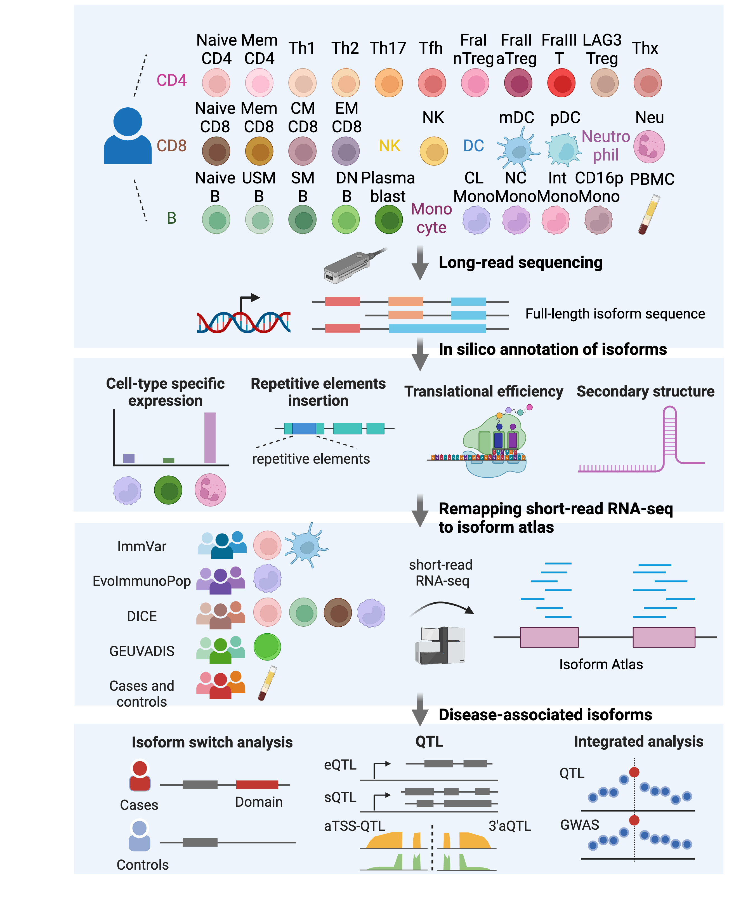

# Isoform Atlas
## Full-length transcript annotation focusing on immune cells
We generated comprehensively full-length isoform annotation, “isoform atlas”, by sequencing diverse immune cell subsets using a long-read sequencer. A wide-range of information, including TSS, ORF, inserted repetitive elements, and functional domains, was identified for all isoforms expressed in immune cell subsets. In addition, Integrated analysis using isoform atlas and publicly available short-read RNA-seq datasets identified a significant number of isoforms that were switched between immune-mediated diseases (IMDs) and controls. Furthermore, we also examined multiple kinds of QTL effects, including eQTL, sQTL, 3' untranslated region (3'UTR) alternative polyadenylation (APA) quantitative trait loci (3'aQTLs) (Li et al., 2021), and a novel concept of aTSS-QTL, of identified isoforms and revealed disease-relevant isoforms by integrating with GWAS. These results are open on the web (link). Isoform atlas will help bridge the gap between genomic and functional analysis and elucidate the pathogenesis of IMDs.

**Reference: Inamo J et al. Isoform Atlas: the landscape of alternative splicing in immune cells. (in preparation)**

**Figure 1. Study design**

## Highlights
- Isoform Atlas with a full-length sequence of 29 immune cell types.
- Cell-type specific expression of isoforms are regulated through binding RBPs to long 3’UTR
- Non-uniform insertion of repetitive elements in isoforms
- RNA secondary structure contributes to translational efficiency 
- Immune-mediated diseases GWAS variants harbor various kinds of QTL effects, including eQTL, sQTL, 3' untranslated region (3'UTR) alternative polyadenylation (APA) quantitative trait loci (3'aQTLs) (Li et al., 2021), and a novel concept of alternative transcription start site QTL(aTSS-QTL)

## How can users utilize Isoform Atlas?
- User-friendly web app is available (In Prep.)
- Users can remapping own RNA-seq datasets to Isoform Atlas(isoform_atlas.gtf.gz, GRCh38) and investigate novel pathogenic isoforms

## colum of "isoform_info.txt"
- isoform: isoform ID
- associated_gene: gene symbol
- chrom: chrosome
- start: start position
- end: end position
- strand: strand
- five_utr_length: length of 5’UTR region
- CDS_length: length of coding region
- three_utr_length: length of 3’UTR region
- polyA_motif: motif of poly A signal (“no-PAS” means no canonical motif)
- kozak_score: kozak score [This is G c c A/G c c atg G. The most important nts are +4, -3 and -6.  Scoring these as +3 and the others as +1. Max score = 13]
- avg_codon_freq: codon frequency averaged across CDS (codon table: http://www.kazusa.or.jp/codon/cgi-bin/showcodon.cgi?species=9606&aa=1&style=N retrieved on 11/20/2014)
- au_element_count: number of AU-stretches
- au_element_frac: percentage of UTR covered by AREs 
- max_au_length: longest A/U stretch
- fiveUTRcap_MFE: minimum folding energy at 5' end (for 5' UTR, specifically affects 43S loading). This is calculated using the sequence of the 50nt after the 5' end, or if the 5' UTR is less than 50nt just calculate using the whole 5’UTR sequence, using viennaRNA
- unique_TSS: transcription start site is specific to the isoform only
- unique_CDS coding sequence is specific to the isoform only
- unique_FE: no overlap with first exon of other isoforms
- unique_LE: no overlap with last exon of other isoforms
- te_rank: ranking according to translation efficiency (top10, others, and bottom 10: e.g., top10 means top 10% of translational efficiency). Translation efficiency is calculated using samples from 52 Yoruba (ribo-seq [GSE61742] and RNA-seq [GEUVADIS cohort, Nature 2013;501:506–511.]) 
- InnateDB: immune genes annotated by InnateDB (https://www.innatedb.com/annotatedGenes.do?type=innatedb)
- TF: transcription factors
- transmembrane: transmembrane proteins
- signal_peptide: isoforms containing signal peptide sequence
- idr: isoforms containing intrinsically disordered protein region
- anchor2: isoforms containing intrinsically disordered binding region
- uORF: isoforms containing predicted upstream open reading frame using ribo-TISH (ribo-seq datasets were downloaded from GSE39561, GSE56887, GSE61742, GSE74279, GSE75290, GSE81802, and GSE97140)
- predicted_NMD: isoforms predicted to cause nonsense-mediated decay 
- specificity_LR: specifically expressed isoforms in any of the long-read sequenced 29 cell-subsets based on both expression and transcript ratio using ROKU function in TCC package
- specific_cell_LR: specifically expressed cell in any of the long-read sequenced 29 cell-subsets
- specificity_LRgroup: specifically expressed isoforms in any of the long-read sequenced 8 cell-groups based on expression and transcript ratio using ROKU function in TCC package
- specific_cell_LRgroup: specifically expressed group in any of the long-read sequenced 8 cell-groups
- •	CD4T: NaiveCD4,Th1,Th2,Th17,Tfh,Fra1.Treg,Fra2.aTreg,Fra3.Treg,LAG3.Treg,MemoryCD4,Thx
- •	CD8T: NaiveCD8,CD8effector,CD8centralmem,CD8effectormem
- •	B: NaiveB,unswmemoryB,swmemoryB,DNB,plasmablast"
- •	DC: myeloidDC,plasmacytoidDC
- •	NK: NK
- •	monocyte: monocyteCD16,monocyteCD16minus,nonclassicalMonocyte,intermediateMonocyte
- •	PBMC: PBMC
- •	Neutrophil: Neutrophil
- specificity_SR_celltype: specifically expressed isoforms in any of the short-read sequenced nonstimulated cell-conditions based on both expression and transcript ratio using ROKU function in TCC package
- specificity_SR_stim: specifically expressed isoforms in any of the short-read sequenced stimulated cell-conditions based on both expression and transcript ratio using ROKU function in TCC package
- specific_cell_SR: specifically expressed cell in any of the short-read sequenced cell-subsets
- matching_repeat: repetitive elements contained in the isoform
- coloc_eQTL: colocalization between eQTL signal of associated gene and any of GWAS signal
- cell_disease_eQTL: cell condition and phenotype of colocalization
- coloc_sQTL: colocalization between sQTL signal of the isoform and any of GWAS signal
- cell_disease_sQTL: cell condition and phenotype of colocalization
- coloc_5UTR_QTL: colocalization between alternative aTSS-QTL signal of the isoform and any of GWAS signal
- cell_disease_5UTR_QTL: cell condition and phenotype of colocalization
- coloc_3UTR_QTL: colocalization between alternative polyadenylation-QTL signal of the isoform and any of GWAS signal
- cell_disease_3UTR_QTL: cell condition and phenotype of colocalization
